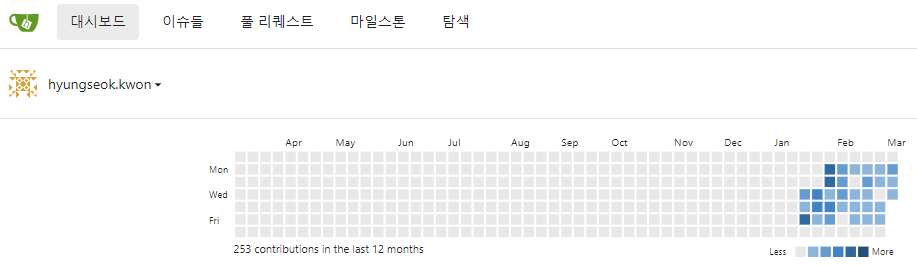
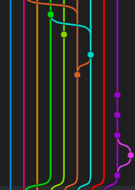
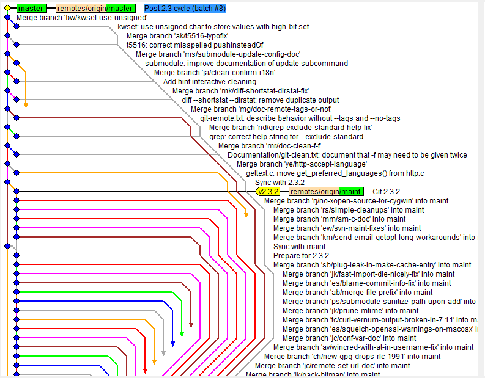
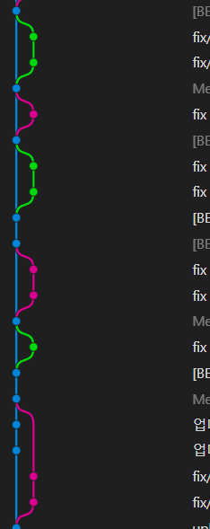

>  > <span style="color: #808080">회사에 입사 하고, 적응하고, 프로젝트도 수행하느라 정말 오랜만에 블로그에 글을 남긴다.😭 앞으로 매일 소소하게나마 알게된, 습득한, 공부한 내용을 기록하고자 한다.
> </span>

## 🌏 Git 브랜치 - rebase의 중요성

- 부트캠프에서 팀프로젝트를 수행하면서, git merge만 사용했었던 기억이 있다.
- 회사에 입사하고 난 후, 여러명이 하나의 프로젝트에 투입되었는데 단순히 `git merge`만 사용할 경우, 여러 문제점이 유발될 수 있음을 인식하게 되었다.
  <br/>
  
  <span style="color: #808080">(복잡하게 커밋그래프가 얽혀있는 모습)</span>
  <br/>

> 🥵 문제점

1. 커밋 그래프가 얽혀있어 변경 사항을 파악하기 힘듦
2. 상대방이 작업하여 커밋한 결과물에 나의 커밋이 달라붙어 얽혀있는(...) 모습
   <br/>

> 
> 극단적으로, Merge만 할 경우, `엄청나게 복잡한 커밋 히스토리`가 생성될 수 있다.
> <br/>

> ✅ 이런 경우, 이전 그래프에서 에러가 발생했을 경우, 커밋을 잘 추적할 수 있을까?

<!-- <hr/> -->

## ✅ Git Merge

Git Merge는 여러 branch들이 존재할 때, 하나의 branch로 통합시키는 개념이다.

## ✅ Git Rebase

Git Rebase는 branch의 base를 재설정한다는 개념이다.

> 즉, 하나의 브랜치가 다른 브랜치에서 파생되서 나온 경우, 다른 브랜치에서 진행된 커밋을 `다시 가져와` base를 `재설정` 하는것.

나와 상대방이 동시에 작업을 했고, 상대방이 먼저 커밋을 했다면, `상대방의 새로운 커밋을 base`로 하는 방식으로 병합 시, conflict 없이 나의 작업물을 반영할 수 있다.

> 

<span style="color: #808080">회사에서 진행중인 프로젝트의 커밋 그래프</span>

<br/>

### Rebase 과정

```
git checkout fe/contract
git add
git commit
git pull -r upstream '원격브랜치'
git push 'origin 브랜치'
pull request
```

```
🧑‍🎓 git pull -r upstream '원격브랜치'란...
push 이전에 다른 작업 결과물을 pull하면서 -r옵션(rebase)을 적용하는 방식
```

#### reference

https://www.atlassian.com/ko/git/tutorials/rewriting-history/git-rebase

```toc

```
