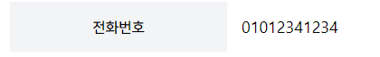
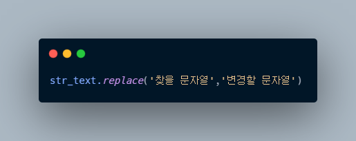
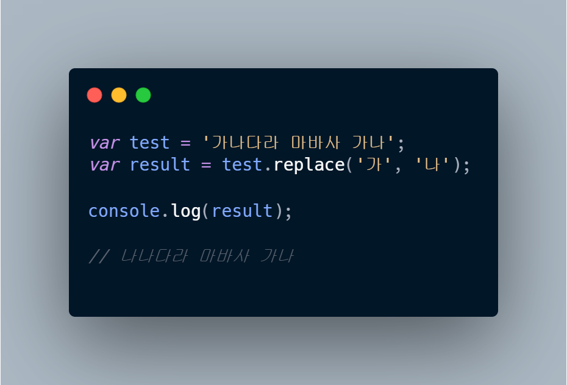
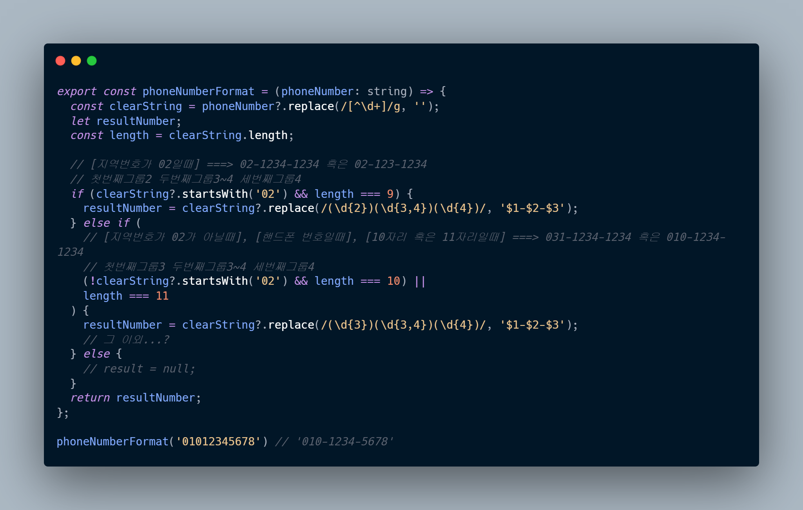

### input에 전화번호를 입력하면 자동으로 '-'를 입력해주는 함수 만들기

> `replace()함수`와 `정규표현식`을 이용했다.

우선 replace()함수에 대해 간략히 알아보자면...


첫번째 파라미터에는 찾을 문자열을, 두번째 파라미터에는 변경할 문자열을 입력한다. 또는 `정규표현식`과 같이 사용할 수 있다.


실행 결과, 맨 앞의 "가" 문자열이 "나"문자열로 치환되었다. `하지만` 뒤의 "가"는 변하지 않고 그대로 남아있다. 그 이유는 replace()함수는 `가장 먼저 일치`하는 패턴만 변환할 뿐 모든 텍스트를 바꾸지는 않기 때문이다.

정규표현식과 replace()함수를 이용하여 `'-'`를 자동 입력해주는 함수를 구현했다.



1. 우선, 숫자 `이외`의 `문자열`을 입력할 경우, 제거하도록 정규표현식을 이용하여 `clearString`함수를 선언하였다.

2. 크게 지역번호가 02인경우와 아닌경우로 구분하였다.
   > #### [지역번호가 02일때]
   >
   > 02-1234-1234 혹은 02-123-1234 모두 가능하므로 length는 9 또는 10

> #### [지역번호가 02가 아닐때], [핸드폰 번호일때], [10자리 혹은 11자리일때]
>
> 031-1234-1234 혹은 010-1234-1234

```toc

```
