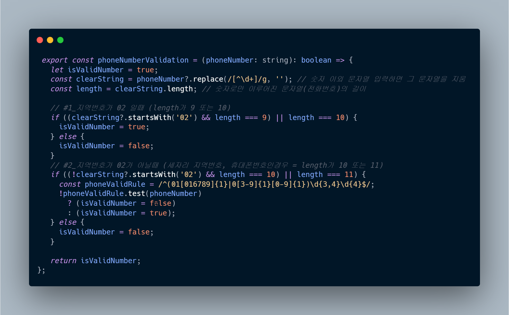
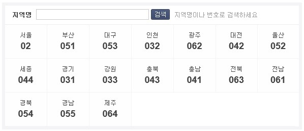
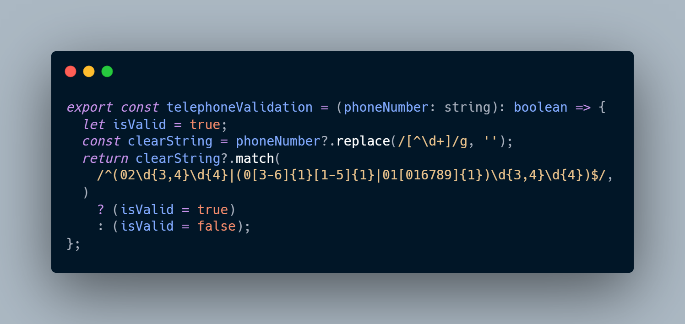

전화번호의 형식이 올바른지 검증하는 함수를 `정규표현식`을 이용하여 구현하였다.

user의 contact 항목에 전화번호를 입력하는 칸이 있는데, 국번 혹은 휴대폰 번호 모두 입력할 수 있는 input이다 보니,
`지역번호`와 `휴대폰 번호`를 모두 한꺼번에 검증할 수 있는 기능이 필요했다.

처음 구현은 `if...else if` 구문을 사용했는데, `if else` 구문이 중첩되어 있고 거기에 `삼항연산자`까지 이용하였더니 가독성이 너무 떨어졌고, 다른 사람이 보기에 이해가 쉽지 않을 것이라고 판단했다.

그래서 코드를 리팩토링했다!

### 처음 구현한 코드



#### 우선 지역번호가 02인지 아닌지로 크게 구분을 하였다.

1️⃣ 먼저, 지역번호가 02인 경우에는 `02 + 숫자 세개 혹은 네개 + 숫자 네개`로 표현될 수 있도록 하였다.

```
/^02\d{3,4}\d{4}$/
```



2️⃣ 그외, 지역번호가 `02가 아닌경우`에는 `그외 지역번호`와 `휴대폰 번호`인 경우가 포함된다.
`휴대폰 번호`에는 `010`, `011`, `016`, `017`, `018`, `019`를 입력 할 수 있도록 구현했다.
`지역번호`를 찾아본 결과, 0xx의 가운데 부분은 `3부터 6`까지 올 수 있고, 마지막은 `1부터 5`까지 올 수 있음을 확인했다.
휴대폰 번호와 지역번호가 02가 아닐때, 가운데 부분은 숫자 세개 혹은 네개를 입력할 수 있도록 하였고, 마지막 부분은 숫자 네개만 입력할 수 있도록 하였다.

```
/^(01[016789]{1}|0[3-6]{1}[1-5]{1})\d{3,4}\d{4}$/
```

### 최종결과물이자 리팩토링 한 코드



```toc

```
