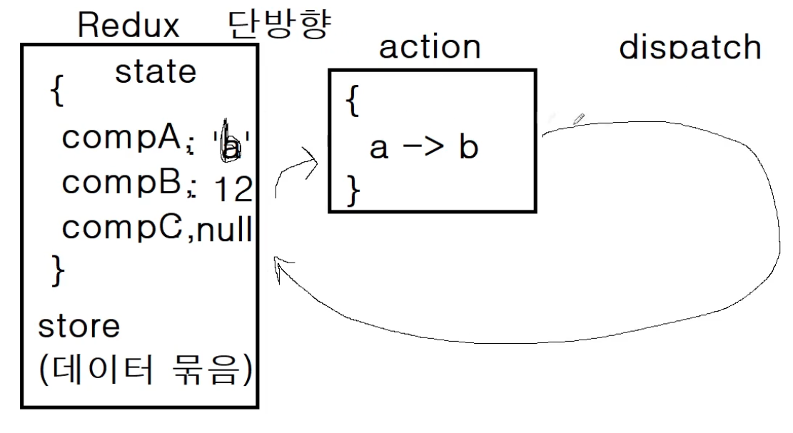

# Redux
여러 컴포넌트 간의 state 문제를 해결하기 위해 등장한 상태관리 라이브러리

## state
> 기본값

## action
> 기본값인 state를 바꾸는것

## dispatch
> 이전 action으로 돌아갈 수 있는 타임머신 기능과 어떤 동작이 취해졌는지에 대한 history가 제공되기 때문에 에러 핸들링이 쉬워진다.

## Reducer
> action이 실행되면 Reducer에서 새로운 객체가 생성되고, 기존 store의 state 객체가 새로운 객체로 `대체`된다.
>action을 받아서 새로운 state를 만들어주는 역할
>dispatch된 액션이 reducer에 걸리고, 다음 state를 만들어낸다.