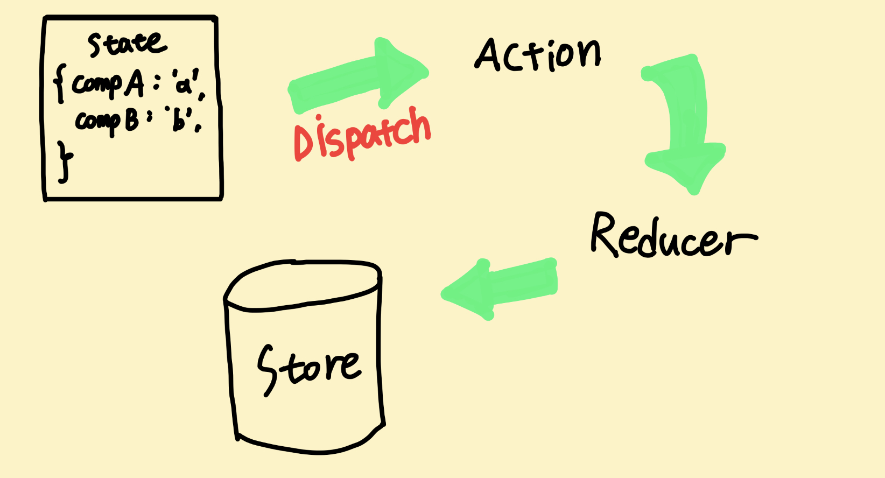

# Redux
`state`를 관리하는 도구  
`store`라는 저장소에서 component들의 state를 관리한다.  
component가 많아지고 관리해야하는 state가 많아지면 props drilling 문제가 발생한다.  
redux를 사용하게 되면 모든 component에서 `reducer함수`와 `action`을 통해 state에 접근할 수 있다.
<br/>

# Redux로 state 관리하는 방법
action을 dispatch하면 reducer함수를 호출한다.  
reducer는 store에 가서 현재 state값을 가져와 새로운 state 객체를 만들고 기존에 존재하던 default state 객체를 `대체`한다




## state
> 기본 객체

## action
기본값인 state를 바꾸는것
dispatch로 action을 객체에 `전달`한다.
>```
>dispatch({type:TEST});
>
>//data 추가
>dispatch({type:TEST, data:'test'})
>```

## dispatch
> 이전 action으로 돌아갈 수 있는 타임머신 기능과 어떤 동작이 취해졌는지에 대한 history가 제공되기 때문에 에러 핸들링이 쉬워진다.

## Reducer
action이 실행되면 Reducer에서 새로운 객체가 생성되고, 기존 store의 state 객체가 새로운 객체로 `대체`된다.
action을 받아서 새로운 state를 만들어주는 역할
dispatch된 액션이 reducer에 걸리고, 다음 state를 만들어낸다.
>    ```
>    export const TEST = 'TEST';
>
>    const rootReducer = (state=0,action){
>     switch(action.type){
>        case TEST
>        return state+1
>        dafult:
>        return state
>     }
>    }
>    ```
>
>action을 dispatch하면 reducer함수가 호출이되는데  
>dispatch로 전달된 action.type에 따라 실행할 코드를 작성하면  
>이전 state에서 변경된 state를 확인하여
>`새로운 state 객체`를 반환해준다.

## Store
>```
>import {createStore} from 'redux';
>export const TEST = 'TEST';
>
>const rootReducer = (state=0,action){
>  switch(action.type){
>    case TEST
>      return state+1
>    dafult:
>     return state
>  }
>}
>
>const store = redux.createStore( rootReducer );//store 생성
>console.log(store.getState())//0 (현재 state 가져오기)
>
>store.dispath({type:TEST})
>console.log(store.getState())//1
>```
>
>createStore로 store를 만들고  
reducer에서 새로운 state값 반환하면  
store에 저장되어 있는 현재 state값이 업데이트된다.
<br/>
<br/>
store는 state를 관리해주고  
getState()는 메서드로 현재 state를 가져오며  
dispatch를 통해 state를 업데이트할 수 있다.  
<br/>
<br/>
그리고 store가 변경되면 dispatch가 store의 subscribe메서드를 통해  
변경된 state값으로 다시 render해주게 된다.  
그러면 변경된 ui로 stater값이 바뀌게된다.

