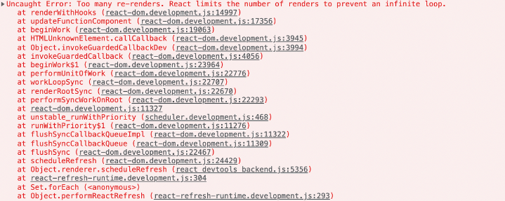

## 👨‍💻  에러

어떤 에러인가?
리액트 무한루프 렌더링
저장할 값을 setState에 넣을때 무한루프가 걸렸다.
에러가 발생하는 원인은 렌더 과정에서 state를 변화하는 함수가 있다면 리랜더링이 계속 일어나면서 발생하는 에러임을 확인했다.
setState는 비동기 방식으로 콜백큐가 모두 비워진 이후에 최종적으로 실행된다.
아마 state의 계속된 변경으로 이러한 에러가 발생된듯하다.

> 에러 핸들링 방법
useEffect를 이용하고 sideEffect로부터 보호하기.
useEffect 내부에서 setState 로직을 넣어줬더니 문제 해결.

> 💡컴포넌트가 리렌더링 되는 조건은...
> state가 변경되었을때
> 부모컴포넌트가 변경되었을때
> props가 변경되었을때
