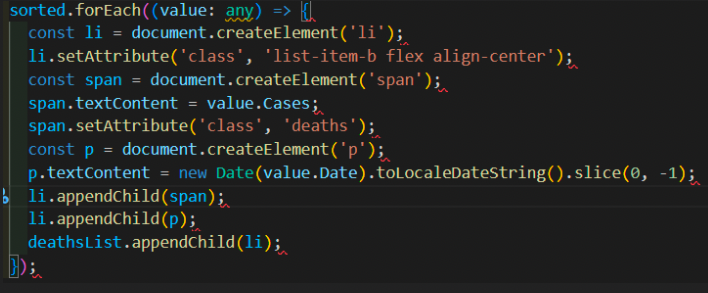
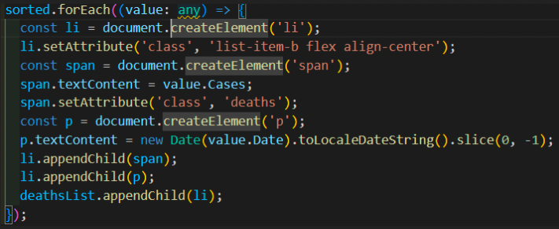

## TypeScript 타이핑 과정 중에 발생한 에러



> 사실 ESLint에서 발생하는 오류라서 실행은 정상적으로 되지만, 거슬리기 때문에 해결하기 위해 구글링을 했다.
> <br/>

# 해결방법

1. 먼저, ESLint 자체에서 해결하기 위해 .eslint.js를 연다.
2. 다음과 같은 문구를 추가한다.

```
  rules: {
        'prettier/prettier': [
            'error',
            {
                endOfLine: 'auto',
            },
        ],
    },
```

<br/>
다음과 같이 에러가 해결되었다!   
<br/>


