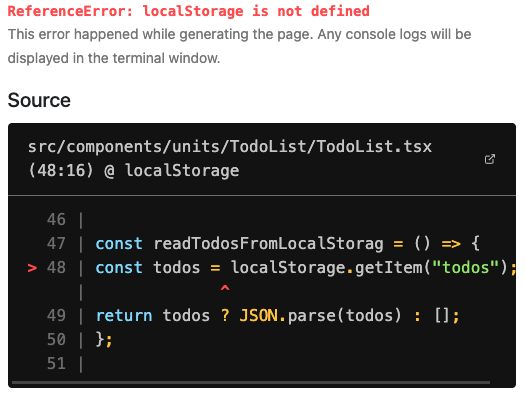

# `localStorage is not defined `

> next.js (ssr)를 이용해서 개발하다 만난 에러  
> <br/>

## ✅ 원인

localStorage가 `window`객체에 정의되어 있지 않고 next.js가 클라이언트 사이드 렌더 이전에 서버 사이드 렌더를 수행하기 때문이다.

<br/>

## ✅ 해결

window 객체에 존재하는지 여부를 살핀 이후에 접근하면 에러메세지가 발생하지 않는다. `존재하는지를 먼저 확인할것!`

```
const readFromLocalStorag = () => {
  const arrays = typeof window !== 'undefined' ? localStorage.getItem("array") : null;
  return arrays ? JSON.parse(arrays) : [];
};
```
