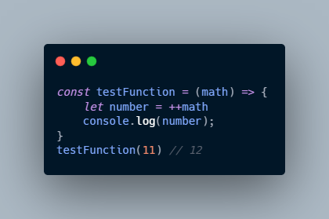
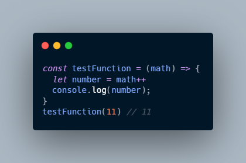
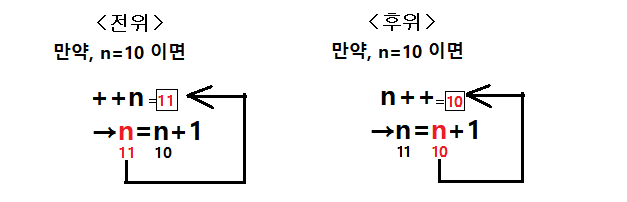

## 증감연산자

프로그램에서 변수값을 1 증가시키거나 감소시키는 상황은 빈번하다. 이럴 때 사용하는것이 `증감연산자` 이다. `증감연산자`는 `전위`와 `후위`로 나뉜다. 전위나 후위 모두 연산 결과 1이 증가된다. 그렇다면, 둘 사이에는 무슨 차이가 있을까.
<br/>

### 1. 전위 (++i)

     연산자 ++가 피연산자 n보다 앞에 위치할 때를 전위라 하고 1증가된 값이 연산결과값이다.
        ++i는 내부적으로 다음과 같이 동작한다.
        1. i의 값을 1 더한다.
        2. i의 값을 반환한다.



### 2. 후위 (i++)

> 반대로 연산자 ++가 피연산자 n보다 뒤에 위치할 때를 후위라 하고 1증가하기 전 값이 연산결과값이다.

    i++는 내부적으로 다음과 같이 동작한다.
    1. i의 현재 값을 보관한다. (현재 실행되는 명령문에서 이 보관된 값이 사용되어야 한다.)
    2. i의 값을 1 더한다.
    3. 보관했던 값을 반환한다.



i++의 경우, `++i`에 `보관`하는 과정이 추가된 것이므로, 많이 사용될 경우, 성능에 차이를 가져온다.

> i++과 ++i는 현재 행에서 사용되는 값이 원래의 값을 사용하는가 혹은 1이 더해진 값을 사용하는가의 차이도 존재하지만
> `성능적`으로 ++i를 사용하는 것이 더 `바람직`하다고 할 수 있다.

<br/>



#### Reference

- 사진 출처:https://codingadinga.tistory.com/11

```toc

```
