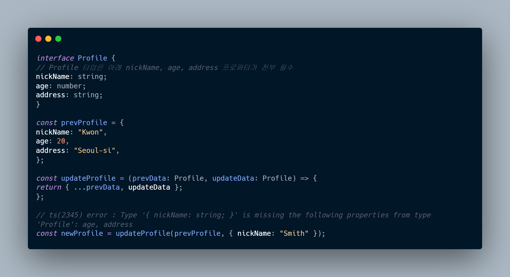
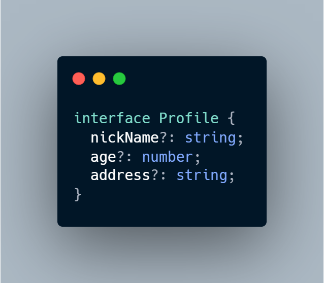
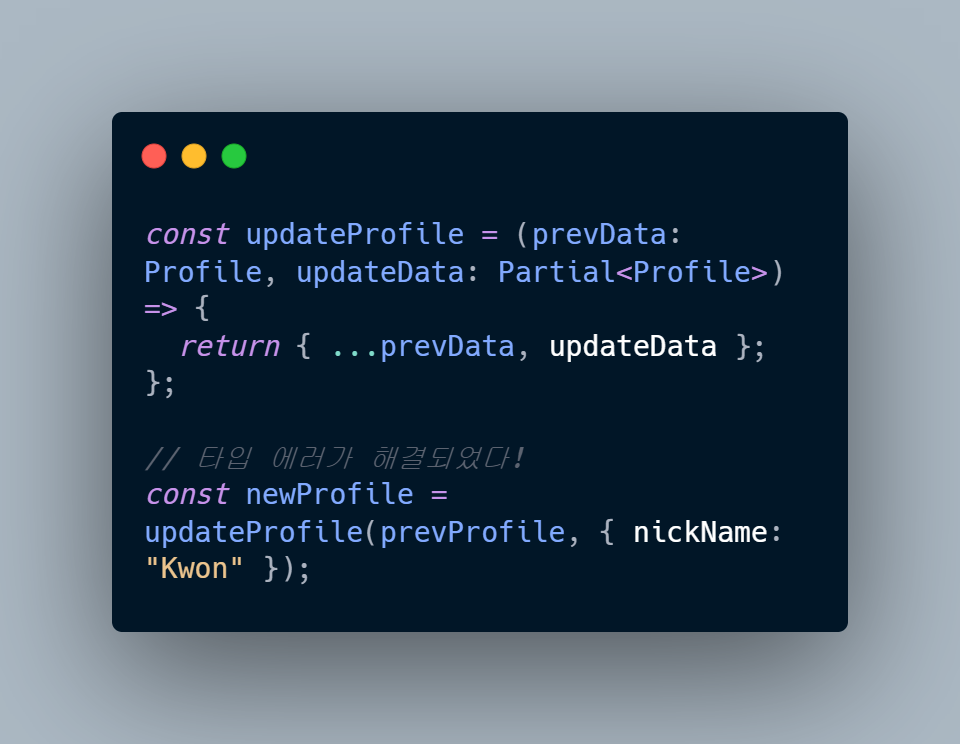

# 1. Partial Type

> Partial 타입은 어떤 타입의 모든 프로퍼티를 `옵셔널`로 바꾸는 기능을 한다.


이 예시에서, Profile interface 객체는 `nickName`, `age`,`address`의 키값을 가지고 있다.

updateProfile 함수의 두 파라미터의 타입은 위에서 지정한 `Profile`이다.

> 하지만, `newProfile`에서 업데이트 시킬 파라미터를 단 한가지만 넘겨주고 있기 때문에, 타입스크립트는 agd, address 파라미터가 추가적으로 필요하다는 에러를 내뿜게 된다.

이럴때, Profile 타입의 프로퍼티를 옵셔널로 설정해준다면, 타입 에러를 해결할 수 있을 것이다.
Profile 타입의 각 프로퍼티의 키값에 일일이 `?`를 붙여줄 수 있지만, 타입 내부에 지정한 프로퍼티가 무수히 많을 경우, 매번 `?`를 붙여넣는것은 불가능에 가깝다고 생각한다.



 <hr/>

#### ✅ 이럴때 `Partial` 타입을 사용하면 되고, 모든 프로퍼티들을 옵셔널로 한번에 변경해준다.



```toc

```
