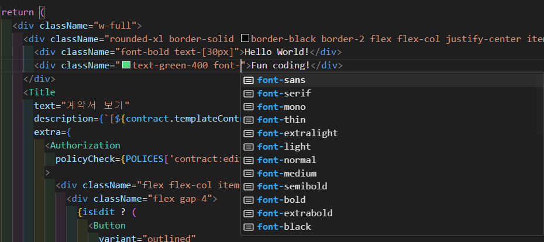

## 요즘 트렌드인 Tailwind CSS

부트캠프에서부터 지금까지 프론트엔드 스타일링 라이브러리중 하나인 `@Emotion/styled-components`를 사용해왔다.

> 따로 `styles.ts`파일을 만들고, 그곳에 스타일링을 지정한 이후 사용할 컴포넌트로 `import`해온 뒤 적용해주는 방식으로.

하지만 스타일을 수정할 필요가 있는 경우, 한 depth를 더 들어가서야 스타일 수정이 가능한 구조였고 매번 코드 유지보수성과 가독성을 위해 `변수명`을 고민했어야 했다.

현재 입사한 회사의 프론트엔드 파트에서는 스타일링을 위해 `tailwind css`를 사용하고 있었고, 습득할 필요성이 생겼다. 어느정도 사용에 익숙해지고 나니 변수명을 고민할 필요도 없고, depth를 더 들어갈 필요도 없이 빠른 스타일링이 가능했다. 엄청난 장점.

## Tailwind CSS란 무엇인가?

Tailwind CSS는 Utility-First 컨셉을 가진 CSS 프레임워크다. 부트스트랩과 비슷하게 `m-1`, `flex`와 같이 미리 세팅된 유틸리티 클래스를 활용하는 방식으로 HTML 코드 내에서 스타일링을 할 수 있다.

✍️ 예시로 똑같은 스타일을 `styled-components`와 `tailwind css`를 이용해서 적용해보면...


## 1.Styled-components

```
** style.ts **

export const RoundedBox = styled.div`
    border-radius = 10px;
    border: 2px solid black;
    display:flex;
    flex-direction:column;
    justify-contents:center;
    align-items:center;
    background-color:skyblue;
    padding:30px
`

export const FirstDiv = styled.div`
    font-weight:bold;
    font-size:30px;
    color:white;
`

export const SecondDiv = styled.div`
    color:#58d480;
    font-weight:bold;
`

```

```
** index.ts **

import * as S from 'styles.ts'

<S.RoundedBox>
    <S.FirstDiv>Hello World!</S.FirstDiv>
    <S.SecondDiv>Fun coding!</S.SecondDiv>
</S.RoundedBox>
```

## 2.Tailwind css

```
** tailwind css **
<div className="rounded-xl border-solid border-black border-2 flex flex-col justify-center items-center w-fit bg-blue-400 p-3 text-white">
    <div className="font-bold text-[30px]">Hello World!</div>
    <div className="text-green-400 font-bold">Fun coding!</div>
</div>

```

> 🎇 코드 분량이 줄어들었고, 변수명을 고민할 필요도 없었다. 또한, CSS 파일을 추가로 생성하지도 않았다!

스타일 코드도 HTML 코드 안에 있기 때문에 HTML파일과 CSS 파일을 별도로 관리할 필요가 없다. 그 덕분에 <strong>HTML-CSS를 왔다갔다하며 시간을 쓰거나, VS코드 화면을 분할해서 사용하지 않아도 된다.</strong>

또한, <strong>태그의 변수명을 고민할 필요가 없다!</strong> 여러 스타일링 방법론이 나올 정도로 까다로운 것이 클래스명을 짓는것인데, Tailwind CSS를 사용하면 태그의 클래스명을 짓는 것에서 해방되므로 `Wrapper`, `InnerWrapper`, `Container`, `SmallWrapper` 등의 클래스명을 고민하지 않아도 된다.


border-radius가 `rounded`, flex-direction:column이 `flex-col` 등 기존과 상이한 클래스명이 존재한다. 따라서 Tailwind CSS가 제공하는 클래스를 학습해야 하고 익숙해져야 하지만, `Intelli Sense`플러그인이 제공되고 있어 익숙해지만 공식 문서 가이드 없이도 빠르게 스타일링할 수 있다.

또한 이전에는 반응형 디자인을 위해 따로 media-query 파일을 생성하여 import 해와 사용했었는데, Tailwind CSS는 반응형 디자인을 위한 클래스명도 제공해준다고 한다. 따라서 현재 진행중인 프로젝트의 반응형 디자인을 Tailwind CSS를 이용해서 해볼 생각.
